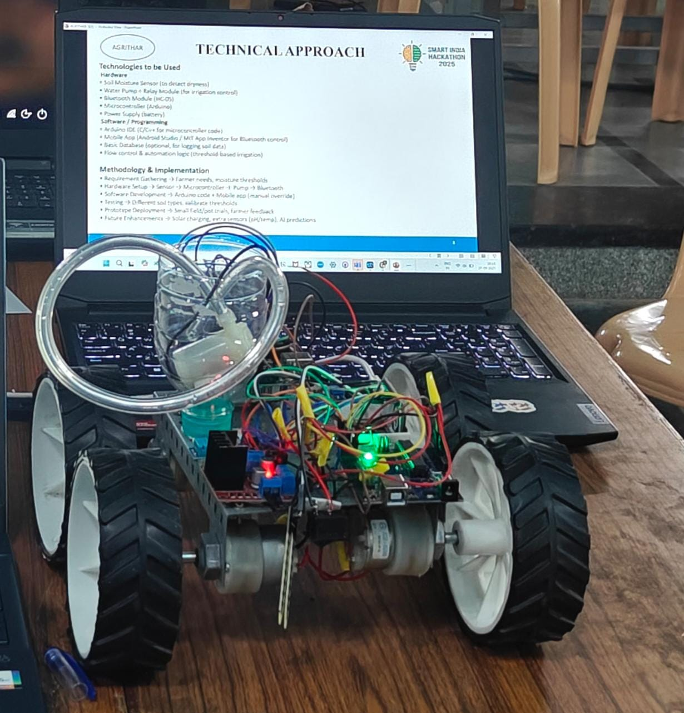
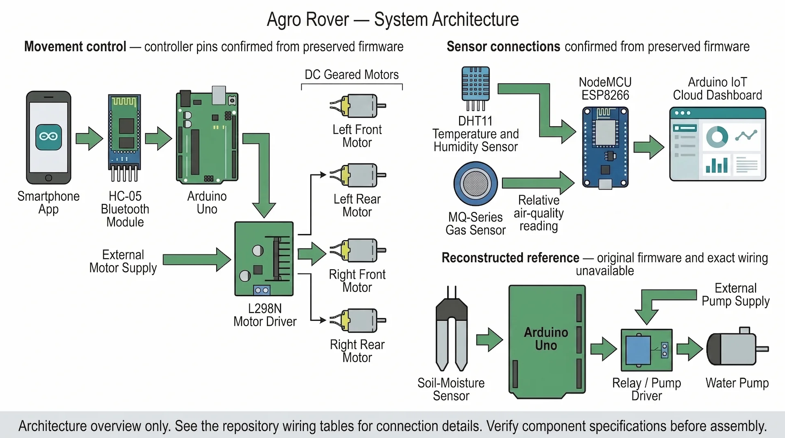
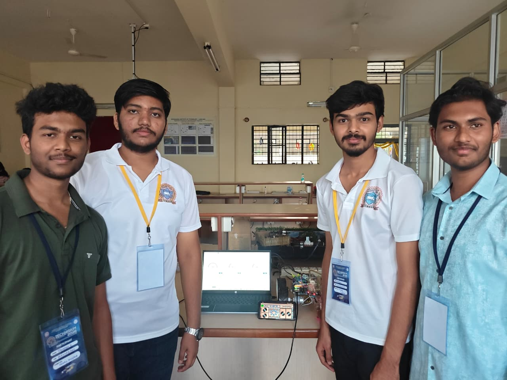
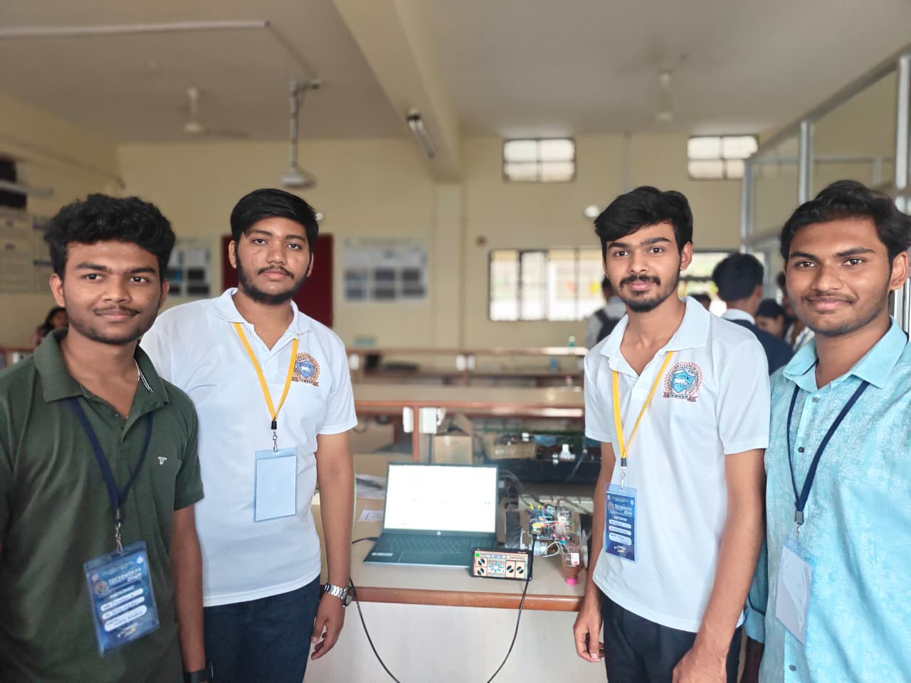
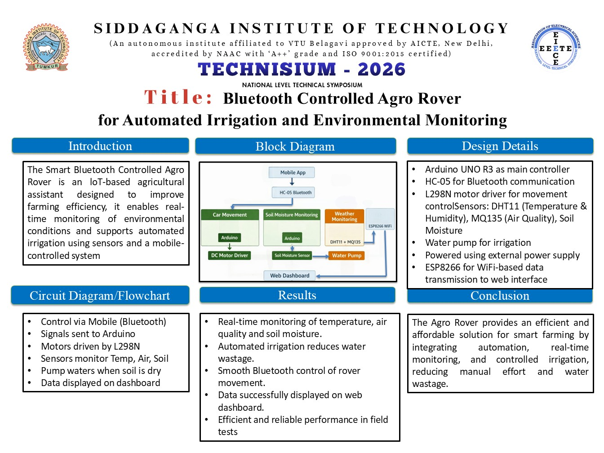
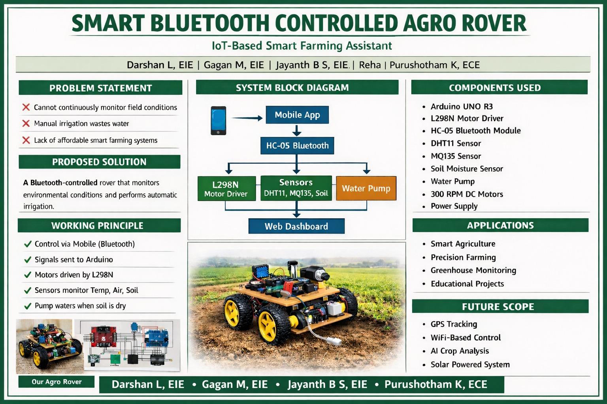

# Agro Rover

> **An IoT-enabled agricultural rover prototype combining remote field movement, environmental monitoring, cloud telemetry, and smart-irrigation concepts.**



**Prototype status:** Student-built demonstration project

**Built with:** Arduino Uno ×2 · NodeMCU ESP8266 · HC-05 Bluetooth · L298N motor driver · DHT11 · MQ-series gas sensor · Soil-moisture sensor · Arduino IoT Cloud

Agro Rover was developed as a modular agricultural-technology prototype for demonstrating mobile field movement, environmental sensing, and soil-moisture-based irrigation. The demonstrated system used three controllers: one Arduino Uno for Bluetooth rover movement, a second Arduino Uno for soil monitoring and pump control, and a NodeMCU ESP8266 for environmental sensing and Arduino IoT Cloud connectivity.

## What the Prototype Demonstrates

- **Remote rover movement** through Bluetooth control
- **Environmental monitoring** of temperature, humidity, and relative air-quality readings
- **Cloud telemetry** through Arduino IoT Cloud
- **Soil-moisture-based irrigation** as part of the demonstrated prototype
- **Modular controller architecture** separating movement, irrigation, and environmental sensing

> **Important:** This repository preserves the surviving rover-control and environmental-monitoring firmware. The original soil-monitoring and irrigation firmware is no longer available, so that subsystem is documented using a reconstructed reference design. The MQ-series output is a relative sensor reading and should not be treated as a calibrated or certified AQI measurement.

## Key Features

- Bluetooth-based rover movement control
- Forward, backward, turning, diagonal movement, and speed control
- Soil-moisture monitoring and automated-irrigation demonstration
- Temperature and humidity monitoring using a DHT11 sensor
- Relative air-quality monitoring using an MQ-series gas sensor
- Arduino IoT Cloud dashboard integration
- Three-controller modular prototype architecture
- Reconstructed wiring documentation for future redevelopment

## System Structure

The demonstrated prototype used three controllers, with each handling a separate subsystem:

1. **Arduino Uno — Rover movement**
   Receives commands from the HC-05 Bluetooth module and controls the four motors through an L298N motor driver.

2. **Arduino Uno — Soil monitoring and irrigation**
   Monitors soil moisture and controls the water pump through a relay or suitable pump-driver module. The original firmware for this subsystem is no longer available.

3. **NodeMCU ESP8266 — Environmental monitoring**
   Collects temperature, humidity, and relative air-quality readings and sends the data to the Arduino IoT Cloud dashboard.

This modular architecture simplified the initial prototype development. During the project evaluation, the judges recommended consolidating the subsystems onto a single capable microcontroller to reduce wiring, size, power requirements, and debugging complexity in a future version.

## Hardware Used

| Component | Quantity | Purpose |
|---|---:|---|
| Arduino Uno | 2 | One for rover movement and one for soil monitoring and irrigation |
| NodeMCU ESP8266 | 1 | Wi-Fi connectivity, environmental sensing, and Arduino IoT Cloud integration |
| L298N motor-driver module | 1 | Controls the rover’s motors |
| HC-05 Bluetooth module | 1 | Receives movement commands from a mobile application |
| DC geared motors | 4 | Drives the rover’s wheels |
| DHT11 sensor | 1 | Measures temperature and relative humidity |
| MQ-series gas-sensor module | 1 | Provides a relative air-quality reading |
| Soil-moisture sensor | 1 | Detects soil-moisture level for the irrigation demonstration |
| Relay or pump-driver module | 1 | Switches the water pump from the irrigation controller |
| DC water pump | 1 | Supplies water during automated irrigation |
| External motor power supply | 1 | Powers the motors through the L298N |
| Suitable pump power supply | 1 | Powers the water pump independently |
| Rover chassis and wheels | 1 set | Provides the prototype’s mobile platform |
| Jumper wires and connecting hardware | As required | Connects the controllers, sensors, and modules |

> Exact models and electrical ratings for some original prototype components are no longer available. Anyone rebuilding the rover should select compatible power supplies, drivers, sensors, and protection components based on the actual hardware specifications.

### System Architecture



> This diagram presents the functional system architecture. Refer to the wiring tables below for connection details.

## Reference Wiring

> **Important:** This wiring was reconstructed from the preserved firmware and project records. The irrigation connections are proposed and may not exactly match the original lost circuit. Verify voltage, current, polarity, and module specifications before rebuilding.

### Rover Movement — Confirmed from Firmware

| Arduino Uno connection | Connected component |
|---|---|
| Pin `5` | L298N `IN1` |
| Pin `6` | L298N `IN2` |
| Pin `10` | L298N `IN3` |
| Pin `11` | L298N `IN4` |
| Pin `0 / RX` | HC-05 `TXD` |
| Pin `1 / TX` | HC-05 `RXD` through a suitable voltage divider |
| `5V` | HC-05 `VCC` |
| `GND` | HC-05 and L298N common ground |
| L298N `OUT1 / OUT2` | Left-side motor or motor pair |
| L298N `OUT3 / OUT4` | Right-side motor or motor pair |
| External motor supply | L298N motor-power input |

The motors must not be powered from the Arduino Uno’s `5V` pin. Disconnecting the HC-05 from pins `0` and `1` may be necessary while uploading firmware.

### Environmental Monitoring — Confirmed from Firmware

| NodeMCU ESP8266 connection | Connected component |
|---|---|
| `D2 / GPIO4` | DHT11 data |
| `3.3V` | DHT11 VCC |
| `GND` | DHT11 ground |
| `A0` | MQ-series sensor analogue output |
| `GND` | MQ-series sensor ground |
| USB or regulated input | NodeMCU power |

The MQ module’s analogue output must remain within the supported input range of the specific NodeMCU board. Use appropriate signal conditioning or a voltage divider when required.

### Soil Monitoring and Irrigation — Reconstructed Reference

| Arduino Uno connection | Connected component |
|---|---|
| `A0` | Soil-moisture sensor analogue output |
| `5V` | Soil-moisture sensor and relay-module VCC |
| `GND` | Soil-moisture sensor and relay-module ground |
| Pin `7` | Relay-module control input |
| Relay `COM` | External pump-supply positive |
| Relay `NO` | Pump positive |
| External supply negative | Pump negative |

Pin `7` is a proposed relay-control pin because the original irrigation firmware and wiring are unavailable. The pump must use a suitable external supply and must never be powered directly from an Arduino pin. Use a proper relay or driver module with the required protection.

## Firmware Structure

```text
firmware/
├── bluetooth_rover_control/
│   └── bluetooth_rover_control.ino
├── environment_monitoring/
│   ├── environment_monitoring.ino
│   ├── thingProperties.h
│   └── arduino_secrets.example.h
└── README.md
```

### Firmware Availability

The repository currently preserves firmware for:

- Bluetooth-based rover movement using an Arduino Uno
- Environmental monitoring and Arduino IoT Cloud connectivity using a NodeMCU ESP8266

The demonstrated prototype also used a second Arduino Uno for soil-moisture monitoring and pump control. That controller’s original firmware was lost and is therefore not included in this repository.

The irrigation wiring shown above is a reconstructed reference for future redevelopment, not a recovered copy of the original implementation.

### Bluetooth Rover Controller

The movement firmware supports the following commands:

| Command | Action |
|---|---|
| `F` | Move forward |
| `B` | Move backward |
| `L` | Turn left |
| `R` | Turn right |
| `G` | Move forward-left |
| `I` | Move forward-right |
| `H` | Move backward-left |
| `J` | Move backward-right |
| `S` | Stop |
| `0–9`, `q` | Adjust speed |

### Environmental Monitoring

The ESP8266 monitoring firmware reads:

- Temperature
- Relative humidity
- Raw gas-sensor value
- Relative air-quality percentage

These readings are sent to Arduino IoT Cloud and summarized through its dashboard.

## Arduino IoT Cloud Setup

1. Create a Thing in Arduino IoT Cloud.
2. Add variables named:
   - `message`
   - `airquality`
   - `humidity`
   - `temperature`
3. Use the data types declared in `thingProperties.h`.
4. Copy `arduino_secrets.example.h` and rename the copy to `arduino_secrets.h`.
5. Add your own Wi-Fi and Arduino Cloud credentials.
6. Replace `YOUR_DEVICE_LOGIN_NAME` in `thingProperties.h`.
7. Install the required Arduino libraries:
   - ArduinoIoTCloud
   - Arduino ConnectionHandler
   - DHT sensor library
8. Select the appropriate ESP8266 board and upload the firmware.

> Never commit your real `arduino_secrets.h` file.

## Project Gallery

### Team Demonstration





### Project Posters





## Team

| Team Member | Contribution Area |
|---|---|
| [Purushotham K](https://github.com/PMK19599) | System integration, project coordination, documentation, and presentation |
| [Gagan M](https://github.com/Gagan234-M) | Rover assembly, Bluetooth movement control, and motor-system testing |
| [Jayanth B S](https://github.com/jayanthbs24-star) | Environmental-monitoring subsystem, sensor integration, and prototype testing |
| Darshan L | Soil-monitoring and irrigation subsystem, hardware assembly, and demonstration support |

> Responsibilities reflect the primary areas handled during this student prototype. The team collaborated across hardware assembly, testing, troubleshooting, and presentation.

Developed as a student agricultural-technology prototype and presented during Technisium 2026.

## Current Limitations

- The rover requires manual Bluetooth control.
- The DHT11 provides basic environmental readings with limited accuracy.
- The gas sensor has not been calibrated for certified AQI measurement.
- The prototype is not weather-resistant.
- Agricultural sensor readings require further field testing and validation.
- The system is intended for demonstration rather than unattended farm operation.

## Future Improvements

Based on prototype testing and feedback received during the project evaluation, future development could include:

- Consolidating the three-controller architecture onto one capable microcontroller to reduce wiring, size, power consumption, and debugging complexity
- Adding spring-based wheel suspension to improve stability and manoeuvrability on uneven agricultural terrain
- GPS-based navigation
- Obstacle detection and autonomous movement
- Camera-based crop-health monitoring
- Calibrated environmental sensors
- Improved soil-moisture-based irrigation control
- Solar-assisted battery charging
- Weather-resistant mechanical and electronics enclosures
- Long-range LoRa communication
- A dedicated mobile or web dashboard

The evaluators considered the prototype promising and encouraged its continued development for practical agricultural applications.

## Attribution and License

The original environmental-monitoring firmware and project documentation are provided under the repository’s MIT License.

The Bluetooth rover-control firmware is adapted from code published by Make DIY / CircuitBest and is not covered by the repository’s MIT License.

See [THIRD_PARTY_NOTICES.md](THIRD_PARTY_NOTICES.md) for its attribution and reuse restrictions.

## Disclaimer

Agro Rover is intended for learning, experimentation, and prototype demonstration. Its sensor readings must be properly calibrated and validated before being used for real agricultural decisions.
